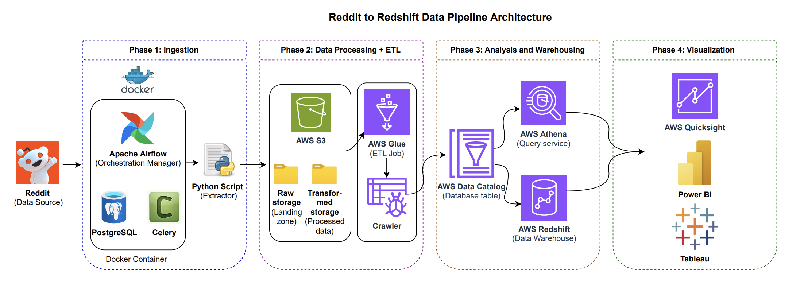

# Reddit Data Engineering Pipeline

A production-ready data engineering pipeline designed to extract, transform, and load (ETL) Reddit data into an Amazon Redshift data warehouse. Leveraging a containerized architecture with Docker and Apache Airflow, the system automates data ingestion from the Reddit API, performs serverless transformations using AWS Glue and Athena, and stages the final dataset for high-performance analytics.

---

## 📑 Table of Contents
- [Overview](#overview)
- [Architecture](#architecture)
- [Technologies](#technologies)
- [Prerequisites](#prerequisites)
- [System Setup](#system-setup)
- [Docker Hub](#docker-hub)

---

## 📖 Overview

This project builds a data pipeline to:
1. **Extract** data from Reddit API using Python.
2. **Store** raw data into an AWS S3 bucket via Airflow.
3. **Transform** the data using AWS Glue and Amazon Athena.
4. **Load** the transformed data into Amazon Redshift for analytics.
5. **Orchestrate** the entire workflow using Apache Airflow running in Docker.

---

## 🏗 Architecture

### 🔄 Data Flow

The pipeline executes in four distinct phases, ensuring data integrity and scalability from ingestion to visualization:

1.  **Phase 1: Ingestion (Docker & Airflow)**
    * The workflow begins with **Apache Airflow** (running in a **Docker** container) triggering a **Python Extraction Script**.
    * This script connects to the **Reddit API** to fetch raw data (posts, comments) based on configured parameters.
    * **PostgreSQL** and **Celery** handle the task queuing and metadata management within the containerized environment.

2.  **Phase 2: Data Processing & ETL (AWS S3 & Glue)**
    * Extracted data is uploaded to an **Amazon S3** bucket, landing in the `Raw Storage` folder.
    * **AWS Glue** performs two key actions:
        * **ETL Jobs:** Clean and transform the raw CSV/JSON data.
        * **Crawlers:** Scan the data to infer schema and structure, updating the central **AWS Data Catalog**.
    * Processed data is stored back into S3 under a `Transformed Storage` folder.

3.  **Phase 3: Analysis & Warehousing (Athena & Redshift)**
    * The **AWS Data Catalog** acts as the bridge, making the S3 data queryable.
    * **Amazon Athena** allows for serverless SQL querying directly against the S3 data for validation and ad-hoc analysis.
    * The final, structured data is loaded into **Amazon Redshift**, serving as the enterprise-grade Data Warehouse for high-performance analytics.

4.  **Phase 4: Visualization**
    * Business Intelligence tools connect to the Redshift warehouse or Athena to visualize insights.
    * Supported integrations include **AWS QuickSight**, **Power BI**, and **Tableau**.



---

## 🛠 Technologies

1. **Reddit API**: Source of the data.
2. **Docker**: Containerizes the extraction pipelines and orchestration services (Airflow, Celery, PostgreSQL) for consistent deployment across any OS.
3. **Apache Airflow & Celery**: Orchestrates the ETL jobs and manages task distribution.
4. **PostgreSQL**: Used as the metadata database for Airflow.
5. **Amazon S3**: Stores raw and transformed data files.
6. **AWS Glue**: Manages the data catalog and serverless ETL jobs.
7. **Amazon Athena**: Performs SQL-based data transformation and ad-hoc analysis.
8. **Amazon Redshift**: Enterprise-grade data warehouse for final analytics.

---

## ✅ Prerequisites

Before running this project, ensure you have the following:

1. **AWS Account**: With permissions for S3, Glue, Athena, and Redshift.
2. **Reddit API Credentials**: Create an app [here](https://www.reddit.com/prefs/apps/) to get your `client_id` and `secret`.
3. **Docker**: Installed and running on your machine.
4. **Python 3.9+**: (Optional, if running scripts outside Docker).

---

## 🚀 System Setup

### 1. Clone the Repository
```bash
git clone https://github.com/Varad-Thikekar/reddit-data-pipeline-aws.git
```


### 2. Create a virtual environment
```
python3 -m venv venv
```

### 3. Activate the virtual environment
```
source venv/bin/activate
```

### 4. Install the dependencies
```
pip install -r requirements.txt
```

### 5. Rename the configuration file and add credentials
```
mv config/config.conf.example config/config.conf
```

### 6. Start the containers
```
docker-compose up -d
```

### 7. Launch the Airflow web UI
```
open http://localhost:8080
```

---

## 🐳 Docker Hub

I have pushed the Docker image for this project to Docker Hub to simplify setup. You can pull the pre-built image directly.

### Pull the image
```
docker pull varadthikekar7/custom-airflow:3.1.3-python3.11
```

